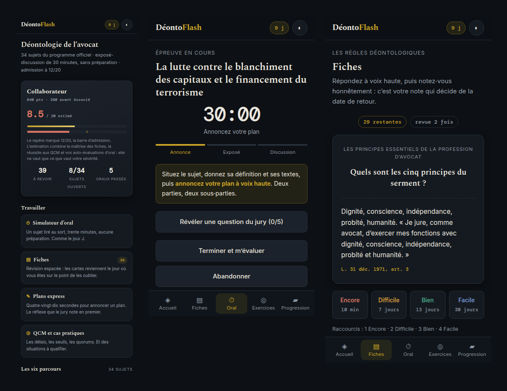

<div align="center">

# Déonto Flash

**Trente minutes. Aucune préparation. Un jury.**

[](https://fschmutz.github.io/deonto-flash/)
[](LICENSE)
[](https://github.com/fschmutz/deonto-flash/wiki/Vie-privee)
[](https://github.com/fschmutz/deonto-flash/wiki)



**[Ouvrir l’application →](https://fschmutz.github.io/deonto-flash/)**

</div>

Entraînement à l’oral de déontologie et de réglementation professionnelle de la profession
d’avocat. Trente‑quatre sujets, six parcours, révision espacée, simulateur d’oral de trente
minutes. Tout s’exécute dans le navigateur : aucun compte, aucun serveur, aucune mesure
d’audience, aucune ressource externe.

## L’épreuve

Un exposé‑discussion de **trente minutes, sans préparation**, devant un jury composé d’un
avocat, d’un magistrat et d’un universitaire. Le sujet est tiré au sort dans un programme
publié. L’admission est prononcée à partir de **12/20**.

Cette application reprend exactement ce format : le sujet apparaît au moment où le
chronomètre démarre, les questions du jury tombent pendant la discussion, et l’exercice se
termine par une grille d’auto‑évaluation notée sur 20.

## Les quatre modes

| Mode | Ce qu’il travaille |
| --- | --- |
| **Simulateur d’oral** | Le format réel : tirage au sort, 30 min chronométrées en trois phases, questions de jury révélées une à une, note /20 sur cinq critères |
| **Fiches** | La mémoire longue. 300 fiches planifiées par [FSRS‑6](https://github.com/open-spaced-repetition) : chaque carte revient le jour où vous êtes sur le point de l’oublier |
| **Plan express** | Le réflexe que le jury note en premier : 90 secondes pour produire un plan annonçable, puis comparaison avec un plan modèle |
| **QCM et cas pratiques** | Longueur au choix (10–100), tirage priorisant les non acquis ; délais, seuils, quorums, et 34 situations à qualifier |

## Les six parcours

Ils suivent l’ordre et les intitulés du programme officiel.

| # | Parcours | Sujets | Sceau |
| --- | --- | --- | --- |
| 01 | Les règles déontologiques | 8 | Le Serment |
| 02 | Organisation professionnelle | 2 | Le Bâton |
| 03 | Exercice professionnel | 12 | La Robe |
| 04 | Les modes et structures juridiques d’exercice | 5 | L’Épitoge |
| 05 | Les honoraires, la comptabilité et la fiscalité | 4 | Le Rabat |
| 06 | La responsabilité civile professionnelle | 3 | La Balance |

Un sceau s’acquiert lorsque 80 % des fiches d’un parcours ont atteint trois semaines de
stabilité mémorielle. Six sceaux, un rang qui progresse d’Élève‑avocat à Doyen de l’ordre,
une série de jours consécutifs, et une **note blanche** estimée sur 20 : pondérée à 50 % par
la maîtrise des fiches, 20 % par la réussite aux QCM et 30 % par la moyenne des cinq
derniers oraux.

## Sources

Le contenu est rédigé à partir de textes publics : loi n° 71‑1130 du 31 décembre 1971,
décret n° 91‑1197 du 27 novembre 1991, règlement intérieur national du Conseil national des
barreaux, code de déontologie des avocats issu du décret du 30 juin 2023, code monétaire et
financier, code de procédure pénale et civile, et jurisprudence publiée. Chaque fiche porte
sa référence.

**Le droit évolue.** Les seuils, délais et montants doivent être vérifiés dans le texte en
vigueur au jour de l’épreuve. C’est un outil d’entraînement, pas une source de droit.

## Vie privée

Rien n’est envoyé. Pas de compte, pas de serveur, pas d’analytique, pas de cookie, pas de
CDN à l’exécution. Les polices sont auto‑hébergées en woff2 (Inter, Spectral, DM Mono, sous
licence SIL Open Font). La politique de sécurité du contenu est `default-src 'self'`. La
progression vit dans le `localStorage` du navigateur ; vider les données du site l’efface.

## Faire tourner en local

```bash
python3 -m http.server 8080
# http://localhost:8080
```

```bash
node --test 'test/*.test.mjs'
```

La suite vérifie que le programme officiel est couvert intégralement et dans l’ordre, que
chaque sujet porte son plan, ses fiches, ses QCM, ses questions de jury et son cas pratique,
qu’aucune bonne réponse ne pointe hors de sa liste d’options, et que le planificateur
FSRS‑6 respecte ses invariants.

```bash
python3 -m http.server 8099 &
python3 scripts/qa-visuelle.py
```

Le contrôle visuel parcourt les vingt‑et‑un écrans dans trois formats et deux thèmes, capture
chacun, et échoue sur toute erreur JavaScript, requête en échec, débordement horizontal,
texte tronqué, cible tactile trop petite ou contraste sous le seuil WCAG AA.

```bash
python3 scripts/parcours-apprenant.py
```

Le parcours apprenant joue l’application comme un candidat : une série de QCM menée jusqu’au
bout, une session de fiches notée sur les quatre boutons, un oral du tirage à la note, un plan
express rédigé puis comparé. Il capture chaque moment d’apprentissage et écrit le texte réellement
affiché dans `parcours/textes.json`, pour que le contenu se relise au lieu de se mesurer.

```bash
python3 scripts/icones.py
```

La marque est dessinée une seule fois, dans `js/ui.js`. Ce script en relit les tracés et
régénère les icônes et la carte sociale, pour qu’elles ne puissent pas diverger du logo.

Si la page en ligne paraît figée sur une ancienne version, un bandeau propose de recharger : 
le service worker sert sinon la version en cache.

## Licence

MIT. Copyright (c) 2026 [Falco Schmutz](https://github.com/fschmutz).
Polices sous licence SIL Open Font, voir `fonts/OFL-*.txt`.
